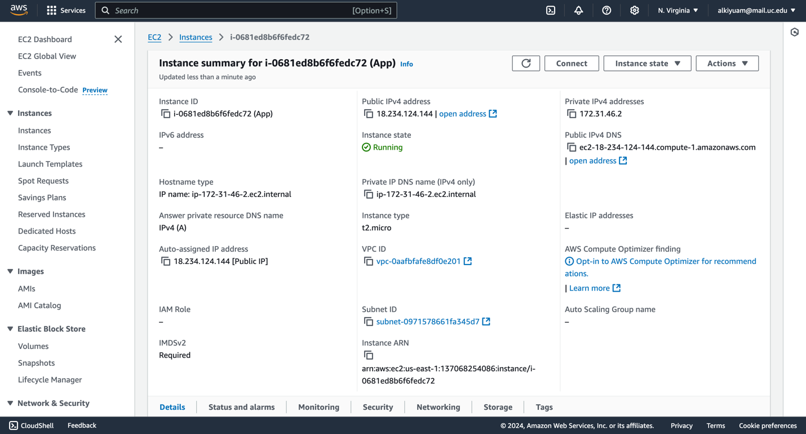
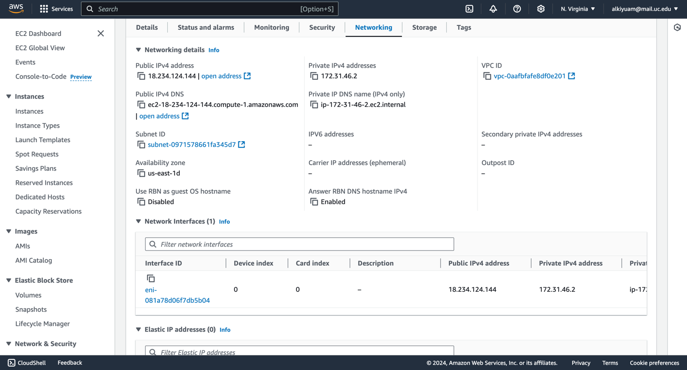

# Project 2: AWS EC2 Web Application with Flask and SQLite

## Project Overview
This project involves setting up an interactive web application using AWS EC2, Flask, and SQLite. The main tasks include creating a web server, setting up a database, designing a registration page, and adding functionality for user authentication. Screenshots of each major step are required for submission, along with the AWS URL and GitHub code link.

### Requirements

### Part 1: EC2 Setup
1. Launch an EC2 instance on AWS (any platform) that is publicly accessible.
2. Take screenshots for each major setup step:
   - AWS portal setups
   - EC2 instance creation
   - AMI selection
   - Key pair generation
   - Network settings

### Part 2: Web Server and Database Setup
1. Configure a Flask application with a SQLite3 database on the EC2 instance.
2. Install the following tools:
   - Python, Pip, and Flask
   - Apache web server and mod_wsgi
   - SQLite3
3. Document your setup with screenshots.

### Part 3: Web Page Design
Design an interactive web page with the following features:

- **Registration Page **:  
  - Input fields for `username` and `password`

- **User Details **:  
  - Input fields for `first name`, `last name`, and `email`

- **Display User Info **:  
  - Redirect to a page displaying submitted information

- **Login Page**:  
  - Requires `username` and `password` to retrieve stored user information

### Submission
1. Submit the AWS URL for the webpage  
   - Example: `http://ec2-x-x-x-xxxx.us-east-2.compute.amazonaws.com`

**Note**: This application has been temporarily taken down due to billing constraints. Thank you for your understanding!

---

### Extra Credit
1. Upload and store the file `Limerick-1.txt`.
2. Display the word count of the file on the page created in Part 3.
3. Provide a download link for the file.
4. Display all information from this step upon re-login.

---

## Application Setup Screenshots

Below are the key screenshots documenting each step of the application setup on AWS EC2.

